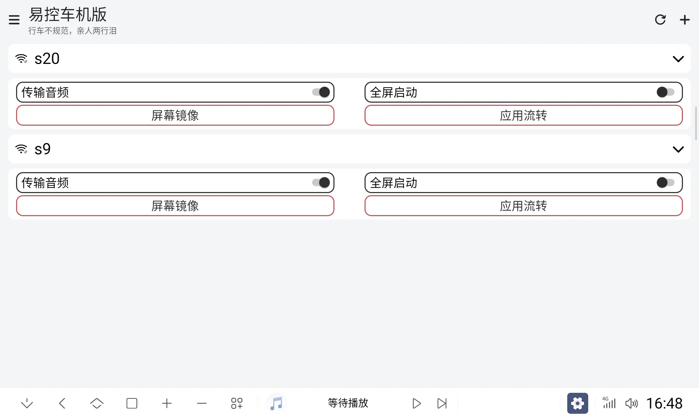
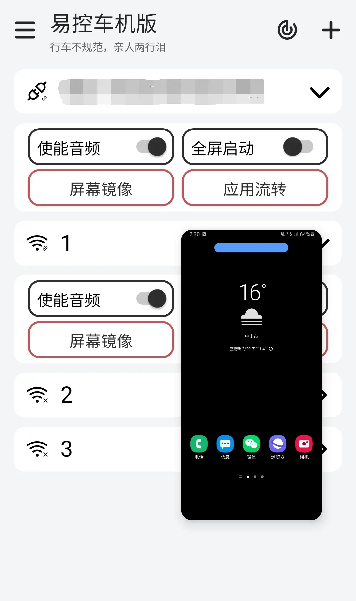
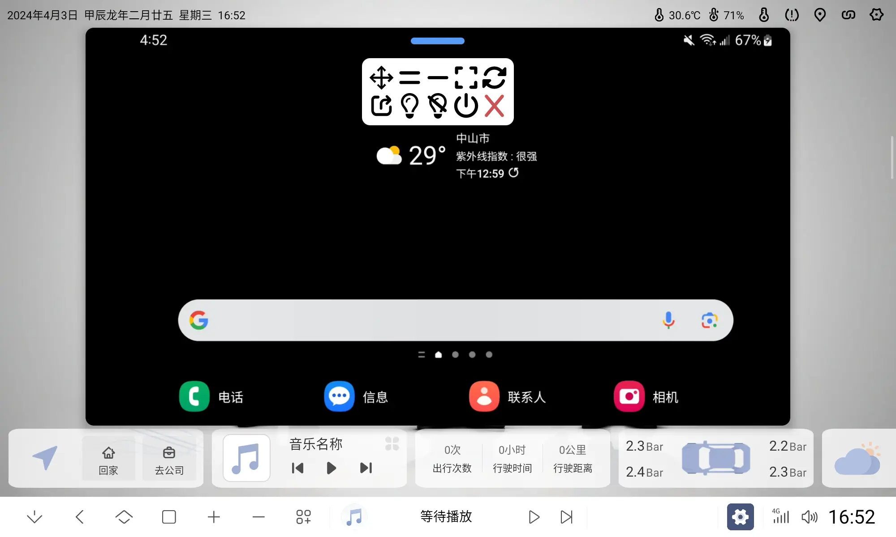
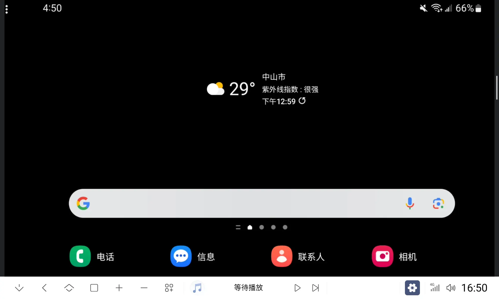

# 易控车机版(Easycontrol_For_Car)

## 注意

#### “易控车机版”**永久免费**，不会收取任何费用，也不会强制要求捐赠。请勿相信任何收费的“易控车机版”，以免上当受骗。

#### 本软件开源许可证为**GPL-3.0**，任何人可以免费使用、修改、分发，但请遵守开源许可证的规定。

#### 本项目唯一地址为(<https://github.com/eiyooooo/Easycontrol_For_Car>)

#### 反馈问题请到[Issues](https://github.com/eiyooooo/Easycontrol_For_Car/issues)，功能建议请到[Discussions](https://github.com/eiyooooo/Easycontrol_For_Car/discussions)。

## 简介
本软件基于[易控原版](https://gitee.com/mingzhixianweb/easycontrol)，对其进行了修改，优化了安卓车机控制安卓手机的体验。

## 车机版功能特色
- 车机版放大按钮
- 横竖屏悬浮窗位置单独保存
- 音频输出为导航声道
- 十秒无操作隐藏控制条
- 应用流转
- 屏幕宽高比例自由缩放(实验性)
- 优化工具栏
  - 自动收回
  - 点击外部时缩回
- 可通过快捷方式直接启动设备或单应用流转
- 其他一些小优化...

## 使用说明
- [点击此处前往易控车机版使用说明](HOW_TO_USE.md)

## 更新日志
- [点击此处查看](https://github.com/eiyooooo/Easycontrol_For_Car/releases)

## 关于开发版本编译
如有需要开发版本请自行[编译](HOW_TO_BUILD.md)。

## 截图

## 捐赠鼓励

如果您觉得我的软件对您有帮助，可以赞助我，十分感谢！

